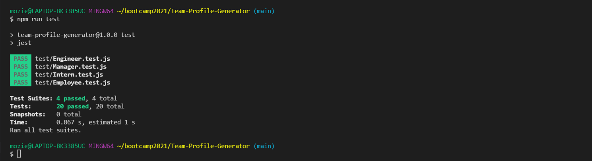

# Team Profile Generator

## Table of Contents

- [Description](#description)
- [Licenses](#licenses)
- [Installation](#installation)
- [Usage](#usage)
- [Technologies](#technologies)
- [Screen shots](#screen-shots)
- [Credits](#credits)
- [Contributions](#contributions)
- [Test](#test)
- [Questions](#questions)


## Description : 
This is a BackEnd Application that runs in Node.js. It uses inquirer npm package to get the user input to dynamically create a team profile based on that input. User can choose between a Manager, an Engineer and an Intern role to pick from and the number of cards created would be based on the user input. Each employee would have it's unique sets of inputs but they will share some common information. After the user made his choices an HTML file will be created and saved using the file system "fs" Node module. 

## Licenses :

[](https://opensource.org/licenses/MIT)


## Installation : 
To install the Team Profile Generator App use the instructions bellow &#8595;
```
npm install
```


## Usage : 
The user needs to install all the dependencies using the "npm install" or "npm i" after that the user can run the app in the node environment using the command "node index.js" and the user will be prompted with question to build his team. The choices would be Manager, Engineer and Intern and the user could build unlimited amount of cards to satisfy his team size. There are validation functions built into the code for each of the command line inputs, so user won't input invalid data in the inputs and will prompt the user to enter valid information.

## Technologies : 

-  HTML.
-  MaterializeCSS.
-  JavaScript.
-  Node.js.
-  FS Node.js module.
-  Promisify Node.js module.
-  Inquirer npm package.
-  Colors npm package.


## Screen shots : 


[The Demo Video]()

## Credits :

- [Muiasar-Al-Ani](https://github.com/Muiasar-Al-Ani)


## Contributions :
    Contributions, issues, and feature requests are welcome!
    Give a ⭐️ if you like this project!


## Test :
After installing all the dependencies user can run command bellow &#8595;

```
npm run test
```
And the tests should pass as bellow &#8595;


## Questions : 
If you have any Question please feel free to contact me:
- muiasar2012@gmail.com
- [Muiasar-Al-Ani](https://github.com/Muiasar-Al-Ani)


&copy; 2021 [Team Profile Generator](https://github.com/Muiasar-Al-Ani)
